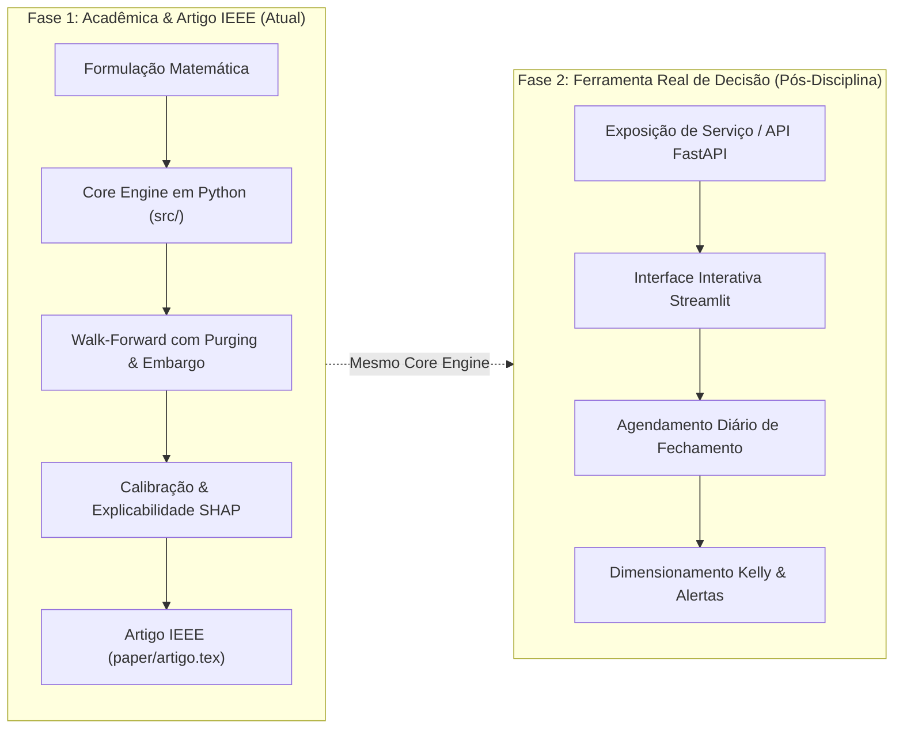

# 🧭 Plano Diretor do Projeto: Motor Modular B3

> **Projeto:** Motor Modular de Análise Preditiva e Decisão Tática para Ações da B3 com Validação Walk-Forward  
> **Disciplina:** Tópicos Especiais em Sistemas Inteligentes: Aprendizado de Máquina (CEFET-MG)  
> **Aluno:** João Paulo Cruz de Faria

---

## 📌 1. Visão Geral

O projeto consiste no desenvolvimento e na validação experimental de uma ferramenta analítica automatizada em Python concebida para atuar como um motor modular de suporte à decisão para o investidor da bolsa brasileira (B3).

Em vez de ser um script rígido amarrado a um único ticker, a ferramenta:
1. **Aceita qualquer ação líquida da B3** como entrada (ex.: PETR4, ITUB4, VALE3, WEGE3).
2. **Coleta e alinha autonomamente** o histórico de preços diários (Yahoo Finance) com os indicadores macroeconômicos do Banco Central do Brasil (SGS/BACEN: Selic diária e Câmbio USD/BRL PTAX).
3. **Calcula métricas quantitativas de desconto histórico** e ciclos temporais frente ao custo de oportunidade da economia (CDI).
4. **Modela a predição como classificação supervisionada** com horizonte tático de **60 pregões úteis** (~3 meses), estimando a **probabilidade calibrada** de o ativo superar a taxa livre de risco:
   $$y_t = \mathbb{I}(R_{t \to t+60} > CDI_{t \to t+60}) \in \{0, 1\}$$
5. **Aplica validação experimental temporal rigorosa** via *Walk-Forward Validation* com técnicas de *Purging* e *Embargo* (López de Prado) para eliminar vazamento de dados gerado por janelas sobrepostas (*overlapping labels*).
6. **Valida a generalização empiricamente** comparando dois setores estruturalmente distintos:
   * **PETR4 (Petrobras):** Commodities cíclicas globais, sensibilidade ao barril de petróleo Brent e risco estatal.
   * **ITUB4 (Itaú Unibanco):** Setor bancário e de crédito doméstico, sensibilidade à Selic e spreads financeiros.

---

## 🏗️ 2. Divisão Estratégica em Duas Fases

---

## 📚 3. Índice da Documentação

A documentação detalhada está organizada nos seguintes módulos:

### 3.1 Fase Acadêmica (`docs/01-fase-academica/`)
* [`etapa_1_definicao_problema.md`](file:///home/jp/Documents/Machine%20Learning/docs/01-fase-academica/etapa_1_definicao_problema.md): Contexto macro e micro, hipóteses científicas, formulação matemática do alvo de excesso de retorno sobre o CDI e viabilidade de dados.
* [`etapa_2_metodologia_pesquisa.md`](file:///home/jp/Documents/Machine%20Learning/docs/01-fase-academica/etapa_2_metodologia_pesquisa.md): Revisão sistemática da literatura recente (2020–2025), taxonomia de modelos (LightGBM, XGBoost, CatBoost, Logistic Regression) e baselines.
* [`protocolo_walk_forward.md`](file:///home/jp/Documents/Machine%20Learning/docs/01-fase-academica/protocolo_walk_forward.md): Protocolo de validação com janelas expansivas, formulação de Purging e Embargo para 60 dias, e calibração de probabilidades.

### 3.2 Arquitetura e Engenharia de Dados (`docs/02-arquitetura-e-dados/`)
* [`motor_modular_especificacao.md`](file:///home/jp/Documents/Machine%20Learning/docs/02-arquitetura-e-dados/motor_modular_especificacao.md): Design de classes em `src/`, princípios SOLID, tipagem estrita e desacoplamento para permitir qualquer ticker.
* [`dicionario_de_features.md`](file:///home/jp/Documents/Machine%20Learning/docs/02-arquitetura-e-dados/dicionario_de_features.md): Fórmulas e fundamentação das features de desconto de preço, momentum, volatilidade e variáveis macroeconômicas.

### 3.3 Fase Ferramenta Real / Produto (`docs/03-fase-ferramenta-real/`)
* [`visao_produto_e_roadmap.md`](file:///home/jp/Documents/Machine%20Learning/docs/03-fase-ferramenta-real/visao_produto_e_roadmap.md): Arquitetura do produto em produção, fluxo de inferência diária, UI e deploy.
* [`gestao_de_risco_kelly.md`](file:///home/jp/Documents/Machine%20Learning/docs/03-fase-ferramenta-real/gestao_de_risco_kelly.md): Uso da probabilidade calibrada $P(Y=1|X)$ para dimensionamento de alocação de carteira via Fractional Kelly Criterion.
