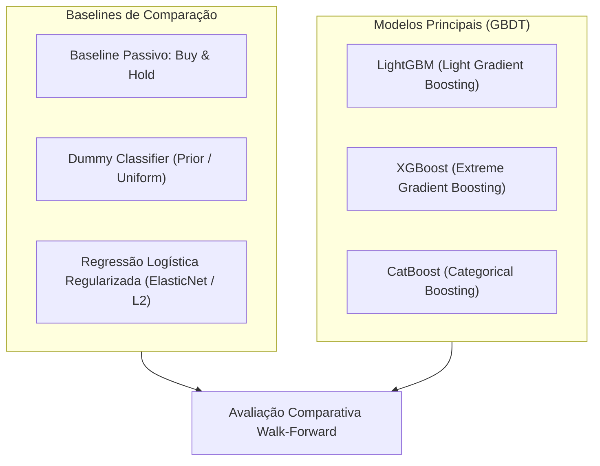

# 📑 Etapa II: Revisão da Literatura e Metodologia Científica

> **Disciplina:** Tópicos Especiais em Sistemas Inteligentes: Aprendizado de Máquina  
> **Tema:** Motor Modular de Análise Preditiva e Decisão Tática para Ações da B3 com Validação Walk-Forward  
> **Entregável:** Fundamentação das Seções II (Revisão da Literatura) e III (Materiais e Métodos) do artigo IEEE.

---

## 1. Revisão Sistemática da Literatura (2018–2025)

A intersecção entre Aprendizado de Máquina e precificação de ativos financeiros consolidou avanços teóricos e empíricos cruciais na literatura recente:

### 1.1 Obras Seminais e Referências Fundamentais
* **López de Prado (2018) — *Advances in Financial Machine Learning*:**
  * Denuncia as principais armadilhas de modelagem preditiva em finanças: vazamento temporal, sobreajuste de backtest (*backtest overfitting*) e não-estacionariedade.
  * Formaliza a técnica de **Purged Group TimeSeriesSplit** e **Embargo**, demonstrando matematicamente que horizontes preditivos sobrepostos violam o pressuposto de independência e distribuição idêntica (i.i.d.) dos dados de treino e teste.
* **Gu, Kelly e Xiu (2020) — *Empirical Asset Pricing via Machine Learning* (Review of Financial Studies):**
  * Realiza o estudo comparativo mais abrangente da literatura moderna, testando centenas de anomalias em milhares de ativos.
  * Conclusão fundamental: Algoritmos de *Gradient Boosting Decision Trees* (GBDT) e Redes Neurais superam amplamente modelos lineares e econométricos clássicos ao identificar não-linearidades e interações entre métricas de preço e covariáveis macroeconômicas.
* **Sezer, Gudelek e Ozbayoglu (2020) — *Financial Time Series Forecasting with Deep Learning: A Systematic Evaluation*:**
  * Demonstra a superioridade de engenharia de atributos estacionários baseados em múltiplos horizontes de momento e osciladores técnicos em comparação ao uso direto de séries temporais não-estacionárias de preços brutos.

### 1.2 Artigos Recentes em Mercados Emergentes e B3 (2021–2025)
* Estudos no mercado brasileiro evidenciam que modelos treinados em ativos da B3 apresentam ganhos expressivos quando alimentados por covariáveis do Banco Central (Selic e Câmbio), devido à forte transmissão de política monetária na precificação de fluxo de caixa futuro das empresas locais.

---

## 2. Taxonomia dos Modelos Comparados

Para garantir o rigor acadêmico, o estudo implementa um protocolo comparativo sistemático entre baselines ingênuos, modelos lineares clássicos e modelos de última geração baseados em árvores de decisão impulsionadas por gradiente:

### 2.1 Descrição dos Modelos

1. **Baselines Ingênuos e Lineares:**
   * **Buy & Hold (Mercado):** Estratégia passiva de compra e manutenção da ação e do Ibovespa ao longo dos 60 pregões, representando o retorno neutro de mercado.
   * **Dummy Classifier:** Emite previsões baseadas na distribuição a priori observada no treino, servindo como piso mínimo de acurácia estatística.
   * **Regressão Logística Regularizada (L2/Ridge):** Modelo linear clássico com penalização de norma dos coeficientes. Atua como baseline paramétrico interpretável.

2. **Modelos Não-Lineares de Gradient Boosting:**
   * **LightGBM:** Algoritmo veloz baseado em crescimento folha-a-folha (*leaf-wise*) com agrupamento de histogramas e seleção baseada em gradiente (GOSS), altamente eficiente para dados tabulares financeiros.
   * **XGBoost:** Algoritmo robusto baseado em árvores exatas com regularização por complexidade de árvore ($\gamma$) e encolhimento de pesos ($\eta$).
   * **CatBoost:** Algoritmo com processamento nativo e ordenação temporal de instâncias (*ordered boosting*), excelente para mitigar o viés de predição em amostras temporais limitadas.

---

## 3. Protocolo de Calibração Probabilística

A probabilidade bruta gerada por modelos de árvore ($\hat{s}_t$) frequentemente não representa a probabilidade a posteriori real $P(Y=1|\mathbf{x})$. Para transformar o score em probabilidade confiável, aplicam-se duas técnicas de pós-processamento ajustadas estritamente no conjunto de calibração temporal:

1. **Platt Scaling (Sigmoide):**
   Ajusta uma regressão logística unidimensional sobre os scores:
   $$\hat{P}(y=1 \mid \hat{s}) = \frac{1}{1 + \exp(A \hat{s} + B)}$$

2. **Regressão Isotônica (Não-Paramétrica):**
   Ajusta uma função monótona não-decrescente por partes, sem assumir distribuição paramétrica a priori:
   $$\min_{m} \sum_{i} \left(y_i - m(\hat{s}_i)\right)^2 \quad \text{sujeito a } m(\hat{s}_i) \le m(\hat{s}_j) \text{ para } \hat{s}_i \le \hat{s}_j$$

---

## 4. Métricas de Desempenho Estatístico e Econômico

A validação é estritamente bidimensional: avalia tanto a capacidade preditiva estatística quanto a rentabilidade ajustada ao risco em simulação de mercado.

### 4.1 Métricas de Discriminação e Calibração
* **ROC-AUC (Área sob a Curva ROC):** Capacidade de ordenação relativa entre classes positivas e negativas, insensível a desbalanceamentos moderados.
* **PR-AUC (Área sob a Curva Precision-Recall):** Mede a precisão em relação à recuperação da classe minoritária.
* **F1-Score Macro:** Média harmônica entre precisão e revocação balanceada entre as classes.
* **Brier Score:** Erro quadrático médio das probabilidades previstas frente aos resultados reais:
  $$\text{Brier Score} = \frac{1}{N} \sum_{i=1}^{N} (\hat{p}_i - y_i)^2$$
* **Log-Loss (Entropia Cruzada Binária):** Penaliza fortemente predições confiantes e erradas.

### 4.2 Métricas de Simulação Financeira (Backtesting)
* **Retorno Acumulado Total ($R_{\text{acum}}$):** Rentabilidade gerada pela estratégia que assume posição comprada quando $\hat{p}_t > \theta_{\text{ótimo}}$ e caixa rendendo 100% do CDI caso contrário.
* **Sharpe Ratio Anualizado:** Retorno excedente sobre o CDI dividido pela volatilidade anualizada da estratégia:
  $$\text{Sharpe} = \frac{\mu_{R_e}}{\sigma_{R_e}} \times \sqrt{252}$$
* **Maximum Drawdown (MDD):** A maior queda percentual de patrimônio de pico a vale observada na curva de capital:
  $$\text{MDD} = \max_{\tau \in [0, T]} \left( \frac{\max_{t \le \tau} V_t - V_\tau}{\max_{t \le \tau} V_t} \right)$$
* **Fricção de Mercado:** Dedução obrigatória de **0,03% por operação** referente a emolumentos, taxa de liquidação da B3 e custos de corretagem.

---

## 5. Auditoria de Interpretabilidade com SHAP

Para superar o paradigma de "caixa-preta", o estudo utiliza **SHAP (SHapley Additive exPlanations)** com o algoritmo otimizado `TreeExplainer`:
* **SHAP Summary Plot (Beeswarm):** Identifica quais atributos exercem maior impacto médio (positivo ou negativo) na probabilidade de superação do CDI.
* **Análise de Dependência (Dependence Plots):** Mapeia o comportamento não-linear das métricas de desconto histórico (ex.: o impacto de um Z-score de -2 desvios na probabilidade prevista).
* **Interpretabilidade Local (Force Plot / Waterfall):** Audita individualmente decisões de alta convicção preditiva para PETR4 e ITUB4.
