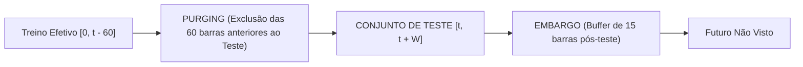

# 🛡️ Protocolo Walk-Forward com Purging e Embargo

> **Referência Metodológica:** Marcos López de Prado, *Advances in Financial Machine Learning* (2018), Capítulo 7.  
> **Aplicação no Projeto:** Validação temporal rigorosa de predição em horizonte tático ($h = 60$ pregões) na B3.

---

## 1. O Problema do Rótulo Sobreposto (*Overlapping Labels*)

Quando definimos o alvo preditivo como o retorno tático dos próximos 60 pregões ($h=60$):

$$y_t = f(P_t, P_{t+60})$$

O rótulo calculado no instante $t$ compartilha **59 pregões de dados de mercado** com o rótulo do instante $t+1$, 58 com $t+2$, e assim sucessivamente.

```
Tempo t:   [---------------- 60 dias ----------------]
Tempo t+1:    [---------------- 60 dias ----------------]
Tempo t+2:       [---------------- 60 dias ----------------]
                       ^--- 58 a 59 dias de informação compartilhada!
```

Se aplicarmos uma validação temporal padrão sem tratamento:
* A variável-resposta no final do conjunto de treino dependerá de preços que ocorreram dentro do início da janela de validação/teste.
* Essa dependência serial gera **vazamento de informação do futuro para o passado**, inflando drasticamente as métricas de acurácia de forma fraudulenta e espúria.

---

## 2. A Solução: Purging e Embargo

Para blindar o protocolo experimental contra qualquer contaminação temporal, implementa-se o esquema formal de **Purging & Embargo**:



### 2.1 Expurgamento (*Purging*)
* **Definição:** Remoção, no conjunto de treinamento, de todas as instâncias temporais cujo horizonte de realização da etiqueta ($[i, i + 60]$) se sobreponha ao período inicial do conjunto de teste ($t_{\text{início}}$).
* **Fórmula do Purge:** Se o conjunto de teste se inicia em $T_{\text{test}}$, qualquer barra de treino com índice $i$ tal que $i + 60 \ge T_{\text{test}}$ é excluída da matriz de treino.

### 2.2 Período de Embargo (*Embargo*)
* **Definição:** Intervalo de segurança adicionado imediatamente após o término do conjunto de teste antes que os dados subsequentes possam ser utilizados como treino em janelas cruzadas.
* Em séries financeiras, resíduos de volatilidade (efeito ARCH/GARCH) e auto-correlação possuem persistência na memória de mercado.
* Adota-se um embargo prudencial de **$E = 15$ pregões** (~3 semanas) para garantir que a memória estocástica se dissipe completamente.

---

## 3. Esquema de Janelas Expansivas (*Expanding Walk-Forward*)

O pipeline de experimentação percorre os 10 anos históricos (2014 a 2024) através de **5 dobras sequenciais expansivas** (*Expanding Window Folds*):

| Dobra | Período de Treino (Expansivo) | Período Purged | Período de Teste Out-of-Sample | Tamanho do Teste |
|---|---|---|---|---|
| **Fold 1** | 2014–2016 (~750 pregões) | Últimos 60 pregões de 2016 | 2017–2018 | ~500 pregões |
| **Fold 2** | 2014–2018 (~1.250 pregões) | Últimos 60 pregões de 2018 | 2019–2020 | ~500 pregões |
| **Fold 3** | 2014–2020 (~1.750 pregões) | Últimos 60 pregões de 2020 | 2021–2022 | ~500 pregões |
| **Fold 4** | 2014–2022 (~2.250 pregões) | Últimos 60 pregões de 2022 | 2023–2024 | ~500 pregões |

### 3.1 Garantias de Integridade
1. Em nenhuma hipótese o modelo tem acesso a parâmetros (médias, desvios, quartis) calculados fora da sua respectiva janela de treino.
2. Cada transformação de feature (`StandardScaler`, `RobustScaler`, seleção de variáveis) é encapsulada em um `sklearn.pipeline.Pipeline`, sendo executado o `fit()` exclusivamente nas observações do treino pós-purge.
3. As previsões e probabilidades calibradas são registradas exclusivamente nas observações fora-da-amostra (*out-of-sample*), acumulando uma série contínua de predições que espelha fielmente a tomada de decisão de um investidor no mundo real.
