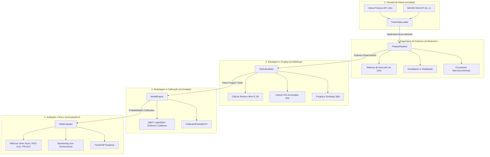

# 🏗️ Especificação de Engenharia: Motor Modular Preditivo B3

> **Escopo:** Arquitetura do código-fonte em `src/`, padrões de projeto (OOP, Clean Code, SOLID) e contratos de interface da ferramenta.

---

## 1. Visão Arquitetural

O motor é desenhado como uma biblioteca desacoplada orientada a objetos em Python. Cada responsabilidade de ciclo de vida (ingestão, engenharia de atributos, rotulagem, modelagem e avaliação de risco) é isolada em módulos coesos e intercambiáveis.



---

## 2. Contratos de Classes e Módulos (`src/`)

### 2.1 `src/data/ticker_loader.py` — `TickerDataLoader`
* **Responsabilidade:** Ingestão agnóstica de tickers da B3 e dados oficiais do BACEN.
* **Assinatura Principal:**
  ```python
  class TickerDataLoader:
      def __init__(self, start_date: str = "2014-01-01", end_date: str | None = None) -> None: ...
      def fetch_stock(self, ticker: str) -> pd.DataFrame: ... # Ex: "PETR4.SA"
      def fetch_macro_series(self) -> pd.DataFrame: ...       # Selic Over (11) e PTAX (1)
      def get_aligned_data(self, ticker: str) -> pd.DataFrame: ...
  ```

### 2.2 `src/features/pipeline.py` — `FeaturePipeline`
* **Responsabilidade:** Cálculo de features estacionárias de desconto de ciclo, momentum, volatilidade e macro.
* **Assinatura Principal:**
  ```python
  class FeaturePipeline:
      def __init__(self, cycle_windows: list[int] = [60, 120, 252, 504]) -> None: ...
      def compute_features(self, df: pd.DataFrame) -> pd.DataFrame: ...
      def get_feature_names(self) -> list[str]: ...
  ```

### 2.3 `src/labeling/tactical.py` — `TacticalLabeler`
* **Responsabilidade:** Rotulagem tática ($R_{60} > CDI_{60}$), remoção de lookahead e aplicação de Purging e Embargo.
* **Assinatura Principal:**
  ```python
  class TacticalLabeler:
      def __init__(self, horizon: int = 60, embargo_days: int = 15) -> None: ...
      def create_labels(self, df: pd.DataFrame) -> pd.DataFrame: ...
      def generate_walk_forward_splits(
          self, df: pd.DataFrame, n_splits: int = 5
      ) -> Generator[tuple[np.ndarray, np.ndarray], None, None]: ...
  ```

### 2.4 `src/models/engine.py` — `ModelEngine`
* **Responsabilidade:** Treinamento, calibração probabilística e inferência para qualquer modelo compatível com Scikit-Learn.
* **Assinatura Principal:**
  ```python
  class ModelEngine:
      def __init__(self, model_type: str = "lightgbm", calibrate: bool = True) -> None: ...
      def fit(self, X_train: np.ndarray, y_train: np.ndarray) -> None: ...
      def predict_proba(self, X_test: np.ndarray) -> np.ndarray: ... # Retorna probabilidade calibrada
      def explain_shap(self, X: np.ndarray) -> tuple[np.ndarray, shap.Explainer]: ...
  ```

### 2.5 `src/evaluation/risk_evaluator.py` — `RiskEvaluator`
* **Responsabilidade:** Consolidação de métricas estatísticas de calibração e simulação financeira com custos de transação.
* **Assinatura Principal:**
  ```python
  class RiskEvaluator:
      def __init__(self, transaction_cost: float = 0.0003) -> None: ...
      def compute_metrics(self, y_true: np.ndarray, y_prob: np.ndarray) -> dict[str, float]: ...
      def backtest_strategy(self, prices: pd.Series, y_prob: np.ndarray, threshold: float = 0.55) -> pd.DataFrame: ...
  ```

---

## 3. Padrões de Qualidade de Código

* **Python 3.10+ com Type Hinting:** Todas as funções possuem tipos explícitos (`typing`, `pandas`, `numpy.typing`).
* **Testes Automatizados (`tests/`):** Testes unitários com `pytest` cobrindo o alinhamento de datas, ausência de NaN nas features e a garantia de que os índices do treino nunca colidem com o teste no Purging.
* **Logging Estruturado:** Uso do módulo `logging` com formatação padronizada e timestamps, sem comandos `print` em código de produção.
