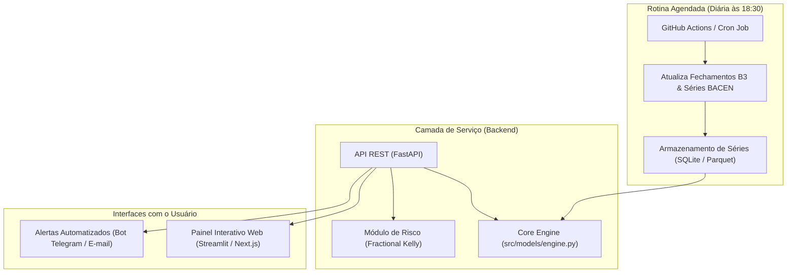

# 🚀 Visão de Produto e Roadmap: Ferramenta Real de Decisão

> **Escopo:** Fase 2 do projeto (Pós-Disciplina) — Transformação do *Core Engine* analítico validado no artigo em uma ferramenta funcional e produtizada para o investidor pessoa física ou institucional da B3.

---

## 1. Proposta de Valor do Produto

A ferramenta opera como um **Copiloto Tático para o Investidor da B3**, respondendo de forma objetiva e probabilística à pergunta:

> *"Dado o preço atual desta ação e o patamar de juros Selic da economia, qual é a probabilidade real de este ativo render mais do que deixar o dinheiro rendendo no CDI nos próximos 3 meses?"*

### Diferenciais Competitivos frente a Casas de Análise Tradicionais:
1. **Totalmente Agnóstico de Opinião Subjetiva:** A recomendação é 100% orientada a dados, calibração estatística e aprendizado supervisionado.
2. **Custo de Oportunidade Embutido:** Não recomenda ações apenas porque "estão baratas" se o CDI estiver pagando mais com risco zero.
3. **Probabilidade Calibrada em Vez de Sinal Binário:** Fornece a convicção estatística exata ($P(Y=1|X) \in [0\%, 100\%]$) e explica as razões da decisão via decomposição SHAP em linguagem acessível.

---

## 2. Arquitetura da Solução em Produção

---

## 3. Funcionalidades da Interface Interativa

1. **Campo de Busca por Ticker:**
   * O usuário digita qualquer código de ação negociada na B3 (ex.: `WEGE3`, `VALE3`, `PETR4`, `BBAS3`).
2. **Card Executivo de Diagnóstico:**
   * **Probabilidade Calibrada de Superar o CDI em 60 Pregões:** Ex.: `72,4% (Alta Convicção)`.
   * **Score de Desconto de Ciclo:** Média ponderada dos desvios históricos de 200 e 500 pregões.
   * **Alocação Sugerida via Critério de Kelly Fracionário:** Ex.: `Exposição recomendada de 12% da carteira`.
3. **Painel de Explicabilidade SHAP Interativo:**
   * Gráfico visual explicando os 5 fatores que mais impulsionaram a probabilidade (ex.: *Desconto histórico em relação à média de 500 dias somou +14% na probabilidade; ciclo de alta da Selic subtraiu -5%*).
4. **Curva Histórica de Backtest do Ativo:**
   * Gráfico comparando a performance acumulada da estratégia tática frente ao *Buy & Hold* do ativo e ao CDI nos últimos 5 anos.

---

## 4. Cronograma de Implementação da Fase 2

| Marco | Prazo Estimado | Entregáveis |
|---|---|---|
| **M1: API REST** | Semana 1 pós-artigo | Endpoints `/analyze/{ticker}`, `/history/{ticker}` construídos em FastAPI com documentação Swagger. |
| **M2: Interface Streamlit** | Semana 2 pós-artigo | Dashboard web interativo com cards de métricas, seletores e gráficos Plotly. |
| **M3: Automação & Alertas** | Semana 3 pós-artigo | Workflow diário via GitHub Actions para atualização de base e envio de digest diário via bot do Telegram. |
| **M4: Empacotamento Docker** | Semana 4 pós-artigo | `Dockerfile` e `docker-compose.yml` para implantação em VPS ou nuvem (Render, AWS, DigitalOcean). |
